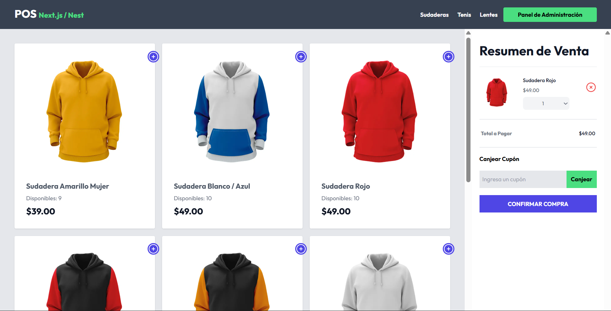

# modern-POS-platform
Sistema de Punto de Venta (POS) moderno y escalable, integrando NestJS en el backend y Next.js 15 (App Router) en el frontend, con TypeScript de principio a fin.

## Descripción General
NextPOS es una plataforma full-stack para la gestión de ventas, productos, categorías y cupones de descuento.
El sistema permite administrar inventario, registrar transacciones, aplicar cupones y consultar ventas históricas por fecha.

El proyecto está diseñado tanto para aprender como para usarse en un entorno real, aplicando buenas prácticas, arquitectura modular y herramientas modernas del ecosistema Node.js.

Incluye:

- Punto de venta con carrito de compras
- Gestión de productos y categorías
- Sistema de cupones con validación y expiración
- Control automático de inventario
- Registro y consulta de ventas
- Panel de administración
- Subida de imágenes con Cloudinary
- Backend REST API con NestJS
- Frontend moderno con Next.js 15 (App Router)

## Características Principales

Punto de venta funcional (POS) 
Categorías dinámicas (sudaderas, tenis, lentes, etc.) 
CRUD completo de productos 
Control de inventario en tiempo real 
Sistema de cupones con expiración y validación 
Cálculo automático de totales y descuentos 
Historial de ventas filtrado por fecha 
Subida de imágenes a Cloudinary 
API REST modular con NestJS 
Frontend con Server Actions y React Query (TanStack) 
Arquitectura clara, escalable y mantenible 

## Tecnologías Utilizadas
### Backend (NestJS)

- NestJS
- Node.js
- TypeScript
- TypeORM (Repository Pattern)
- PostgreSQL
- Arquitectura modular (Modules, Controllers, Services, DTOs, Entities)
- Validaciones con Pipes
- Seeders para datos iniciales

### Frontend (Next.js)

- Next.js 15
- App Router
- TypeScript
- Server Actions
- TanStack Query (React Query)
- Tailwind CSS
- Componentes reutilizables
- Formularios con validación

### Servicios Externos
- Cloudinary (subida y gestión de imágenes)

### Tooling

- NPM
- Git & GitHub
- ESLint & Prettier

## Arquitectura del Proyecto

El proyecto está dividido en dos grandes módulos:

### BackendSPV (NestJS)

```bash
/src
├── categories        # Categorías de productos
│   ├── dto
│   ├── entities
│   ├── controller
│   ├── service
│   └── module
├── products          # Productos e inventario
├── coupons           # Cupones y descuentos
├── transactions      # Ventas y transacciones
├── upload-image      # Subida de imágenes (Cloudinary)
├── seeder            # Seeders de datos
├── common            # Pipes y utilidades compartidas
├── config            # Configuración de TypeORM
├── app.module.ts
└── main.ts
```

Esta arquitectura permite:

- Separación clara de responsabilidades
- Escalabilidad
- Código fácil de mantener y probar

### Frontend (Next.js 15 – App Router)

```bash
/app
├── (store)           # Tienda pública
│   ├── [categoryId]
│   └── page.tsx
├── admin             # Panel de administración
│   ├── products
│   └── sales
├── coupons/api       # API routes para cupones
├── layout.tsx
└── providers.tsx

/components
├── cart              # Carrito y checkout
├── products          # Gestión de productos
├── transactions      # Ventas
└── ui                # Componentes UI

/actions               # Server Actions
/src                   # Utilidades, API y store
```

## Requisitos Previos

Asegúrate de tener instalado:
- Node.js >= 18
- NPM
- PostgreSQL
- Cuenta en Cloudinary

## Instalación
Clonar el repositorio

```bash
git clone https://github.com/sebastian-alpizar/modern-POS-platform.git
cd retail-management-platform
```

### Configuración del Backend

```bash
cd backend
npm install
```

Configurar variables de entorno (`.env`):
- Base de datos PostgreSQL
- Credenciales de Cloudinary

Copiar y configurar el archivo `.env` a partir de `.env.example`:
```bash
cd backend
cp .env.example .env
```
Editar `.env` con tus credenciales de base de datos y configuración de puerto:

```bash
DATABASE_HOST=
DATABASE_PORT=
DATABASE_USER=
DATABASE_PASS=
DATABASE_NAME=
CLOUDINARY_NAME=
CLOUDINARY_API_KEY=
CLOUDINARY_API_SECRET=
```

### Ejecución del Frontend
Copiar y configurar `.env` a partir de `.env.example`:
```bash
cd frontend
cp .env.example .env
```

Editar `.env` con las credenciales y puerto del Backend al que conectarse:
```bash
API_URL=
NEXT_PUBLIC_API_URL=
NEXT_PUBLIC_DOMAIN=
```

Construir el proyecto
```bash
npm install
npm run dev
```

Flujo del Sistema

1. El usuario navega por las categorías
2. Agrega productos al carrito
3. Aplica cupones de descuento
4. El sistema valida stock y cupón
5. Se confirma la compra
6. La venta se guarda en la base de datos
7. El inventario se actualiza automáticamente
8. El administrador puede consultar ventas por fecha

## 📊 Ejemplos Visuales


## Funcionalidades Clave del POS

- Ventas con múltiples productos
- Límite dinámico según inventario
- Cupones válidos, inválidos o expirados
- Historial diario de ventas
- Edición de productos en tiempo real
- Paginación con TypeORM
- Panel administrativo completo

## Despliegue

### Backend (NestJS)

- VPS / Railway / Render
- Configurar `.env`
- Base de datos PostgreSQL
- Cloudinary

### Frontend (Next.js)
```bash
npm run build
```
Publicar en:
- Vercel (recomendado)
- Netlify

## Autor

**Desarrollado por Sebastián Alpízar Porras**  
GitHub: https://github.com/sebastian-alpizar  
Email: sebastianalpiz@gmail.com
